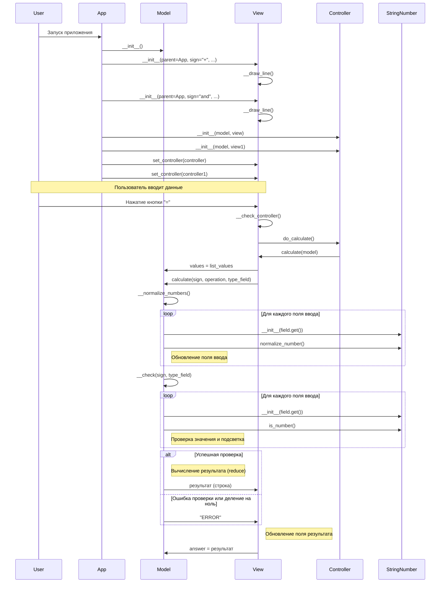

# Диаграмма последовательностей для app_calculator_fields_mvc.py

## Описание диаграммы последовательностей

### Инициализация приложения

1.  **Запуск приложения**: Пользователь запускает скрипт, что приводит к созданию экземпляра класса `App` (который наследуется от `Tk`).
2.  **Создание Model**: `App` создает экземпляр `Model` для хранения состояния.
3.  **Создание View**: `App` создает один или несколько экземпляров `View`. При инициализации `View`:
    *   Вызывается `__draw_line()`, который создает необходимые виджеты Tkinter (`Entry`, `Label`, `Button`) и размещает их в окне.
    *   Кнопке "=" назначается команда `__check_controller`.
4.  **Создание Controller**: `App` создает экземпляры `Controller`, связывая каждый `View` с `Model`.
5.  **Установка Controller в View**: `App` вызывает метод `set_controller()` для каждого `View`, передавая соответствующий `Controller`.

### Процесс вычисления

1.  **Ввод данных**: Пользователь вводит числовые или строковые значения в поля `Entry`.
2.  **Нажатие кнопки "="**: Пользователь нажимает кнопку "=" рядом с одним из рядов полей.
3.  **Вызов контроллера**: `View` (`__check_controller()`) вызывает метод `do_calculate()` у связанного с ним `Controller`.
4.  **Запуск вычисления в View**: `Controller` (`do_calculate()`) вызывает метод `calculate()` у `View`, передавая экземпляр `Model`.
5.  **Передача данных в Model**: `View` (`calculate()`) присваивает свой список полей `Entry` свойству `values` у `Model`.
6.  **Вызов вычисления в Model**: `View` вызывает метод `calculate()` у `Model`, передавая знак операции, саму операцию и ожидаемый тип данных.
7.  **Нормализация**: `Model` (`calculate()`) вызывает `__normalize_numbers()`:
    *   Для каждого поля `Entry` в `Model.values` создается `StringNumber`.
    *   Вызывается `normalize_number()` для очистки и стандартизации строки.
    *   Значение поля `Entry` обновляется.
8.  **Проверка**: `Model` (`calculate()`) вызывает `__check()`:
    *   Для каждого поля `Entry` проверяется, является ли его значение числом (`StringNumber.is_number()`) и допустимо ли оно для операции (например, не деление на ноль).
    *   Поля с некорректными данными подсвечиваются розовым.
    *   Метод возвращает `True`, если все поля корректны, иначе `False`.
9.  **Вычисление (если проверка успешна)**: Если `__check()` вернул `True`, `Model` (`calculate()`) преобразует значения полей в числа (float) и выполняет операцию (`reduce`).
10. **Возврат результата**: `Model` (`calculate()`) возвращает результат вычисления в виде строки или строку "ERROR", если проверка не пройдена.
11. **Отображение результата**: `View` (`calculate()`) получает результат от `Model` и отображает его в своем поле `result_entry`.
12. **Сохранение ответа**: `View` (`calculate()`) также сохраняет полученный результат в свойстве `answer` у `Model`.