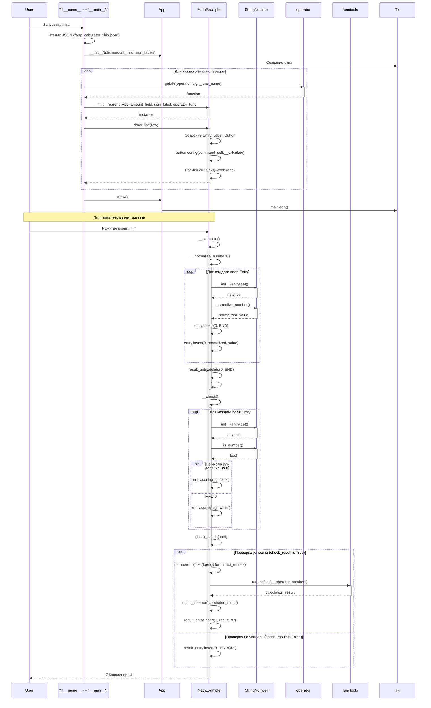

# Диаграмма последовательностей для app_calculator_fields.py (OOP)

## Описание диаграммы последовательностей

Эта диаграмма иллюстрирует взаимодействие между классами в объектно-ориентированной версии приложения калькулятора (`app_calculator_fields.py`).

### Инициализация приложения

1.  **Запуск скрипта**: При запуске скрипта (`if __name__ == '__main__':`) читается конфигурация из JSON.
2.  **Создание App**: Создается экземпляр класса `App`, который инициализирует главное окно Tkinter (`Tk`).
3.  **Создание MathExample**: В цикле для каждого знака операции (`sign_label`) из конфигурации:
    *   Получается соответствующая функция оператора из модуля `operator`.
    *   Создается экземпляр `MathExample`, передавая ему родительское окно (`App`), количество полей, знак операции и функцию оператора.
    *   Вызывается метод `draw_line()` у экземпляра `MathExample`.
4.  **Отрисовка строки (MathExample.draw_line)**:
    *   Создаются виджеты `Entry` для ввода чисел и сохраняются в `__list_entries`.
    *   Создаются виджеты `Label` для отображения знака операции.
    *   Создается виджет `Entry` для вывода результата (`__result_entry`).
    *   Создается виджет `Button` ("=") и ему назначается команда `__calculate`.
    *   Все виджеты размещаются в окне с помощью `grid()`.
5.  **Запуск главного цикла**: `App` вызывает `draw()`, который запускает главный цикл событий Tkinter (`mainloop()`).

### Процесс вычисления

1.  **Ввод данных**: Пользователь вводит числа в поля `Entry`.
2.  **Нажатие кнопки "="**: Пользователь нажимает кнопку "=" для определенной строки операций.
3.  **Вызов MathExample.__calculate**: Нажатие кнопки вызывает метод `__calculate` соответствующего экземпляра `MathExample`.
4.  **Нормализация (MathExample.__normalize_numbers)**:
    *   Метод `__calculate` сначала вызывает `__normalize_numbers`.
    *   Для каждого `Entry` в `__list_entries`:
        *   Получается его значение (`get()`).
        *   Создается экземпляр `StringNumber` с этим значением.
        *   Вызывается `normalize_number()` для очистки строки (удаление пробелов, замена запятой на точку).
        *   Поле `Entry` очищается (`delete()`) и в него вставляется (`insert()`) нормализованное значение.
    *   Поле результата (`__result_entry`) очищается.
5.  **Проверка (MathExample.__check)**:
    *   Метод `__calculate` вызывает `__check` для валидации введенных данных.
    *   Для каждого `Entry` в `__list_entries`:
        *   Фон устанавливается на белый (`bg='white'`).
        *   Создается экземпляр `StringNumber`.
        *   Проверяется, является ли значение числом (`is_number()`).
        *   Проверяется деление на ноль (если операция `/`, `//` или `%`, значение не должно быть "0").
        *   Если проверка не пройдена, фон поля `Entry` меняется на розовый (`bg='pink'`).
        *   Подсчитывается количество корректных полей.
    *   Метод возвращает `True`, если все поля содержат корректные числа (и нет деления на ноль), иначе `False`.
6.  **Вычисление (если проверка успешна)**:
    *   Если `__check()` вернул `True`:
        *   Создается генератор чисел (`float(field.get())` для каждого `Entry` в `__list_entries`).
        *   Используется `functools.reduce` с оператором (`self.__operator`), переданным при инициализации `MathExample`, для последовательного применения операции ко всем числам.
        *   Результат преобразуется в строку.
7.  **Отображение результата**: 
    *   Если вычисление прошло успешно, результат вставляется в `__result_entry`.
    *   Если проверка (`__check()`) не удалась, в `__result_entry` вставляется строка "ERROR".

