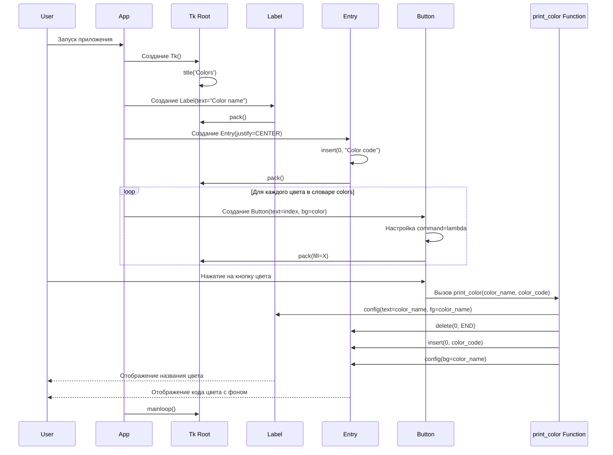

# Диаграмма последовательностей для функциональной версии Rainbow App

Эта диаграмма последовательностей описывает работу функциональной версии приложения Rainbow (строки 140-174 в файле app_rainbow.py). В этой версии используется словарь цветов и единая функция `print_color` для обработки всех цветов.

## Описание диаграммы

### Компоненты

1. **User** - пользователь, взаимодействующий с приложением
2. **App** - основное приложение
3. **Tk Root** - корневое окно Tkinter
4. **Label** - метка для отображения названия цвета
5. **Entry** - поле ввода для отображения кода цвета
6. **Button** - кнопки для выбора цветов
7. **print_color Function** - функция для обработки выбора цвета

### Процесс работы

1. Приложение создает корневое окно Tk и устанавливает заголовок "Colors"
2. Создаются виджеты Label и Entry для отображения информации о цвете
3. В цикле создаются кнопки для каждого цвета из словаря colors
4. Каждой кнопке назначается обработчик события с использованием lambda-функции
5. При нажатии на кнопку вызывается функция print_color с соответствующими параметрами
6. Функция print_color обновляет Label и Entry, отображая информацию о выбранном цвете
7. Запускается главный цикл обработки событий mainloop()

### Особенности реализации

В этой функциональной версии приложения:

- Используется словарь `colors` для хранения названий цветов и их кодов
- Применяется единая функция `print_color` для обработки всех цветов
- Используется lambda-функция для передачи параметров в обработчик события
- Реализация более компактна по сравнению с процедурной версией, где для каждого цвета была отдельная функция

Эта версия представляет собой промежуточный этап между процедурным и объектно-ориентированным подходами к разработке приложения Rainbow.