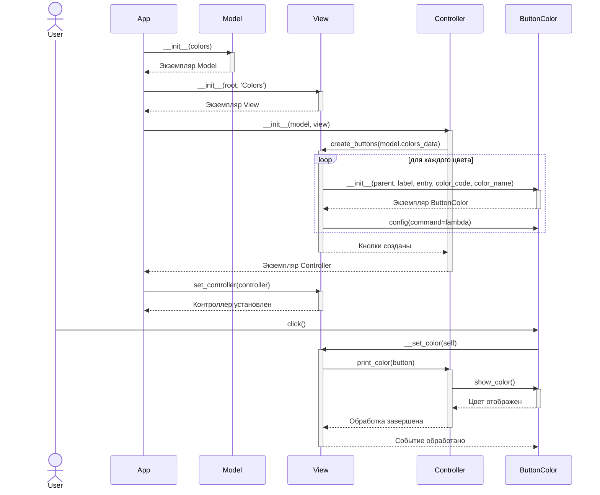

# Диаграмма последовательностей: Внутреннее взаимодействие классов Rainbow App

Эта диаграмма иллюстрирует взаимодействие между классами, определенными непосредственно в файле `app_rainbow.py` (строки 177-309), во время инициализации приложения и обработки нажатия кнопки. Импортированные классы (например, из `tkinter`) не показаны.

## Описание диаграммы

Диаграмма показывает следующие шаги:

1.  **Инициализация**: `App` создает экземпляры `Model`, `View` и `Controller`. `Controller` затем поручает `View` создать кнопки (`ButtonColor`).
2.  **Создание кнопок**: `View` создает экземпляры `ButtonColor` для каждого цвета и настраивает их обработчики событий.
3.  **Установка контроллера**: `App` передает ссылку на `Controller` в `View`.
4.  **Нажатие кнопки**: `ButtonColor` вызывает метод `__set_color` в `View`. `View` делегирует обработку `Controller` (метод `print_color`). `Controller` вызывает метод `show_color` у соответствующего `ButtonColor` для обновления интерфейса.

Класс `Errors` не участвует в этих потоках и поэтому не показан на диаграмме.