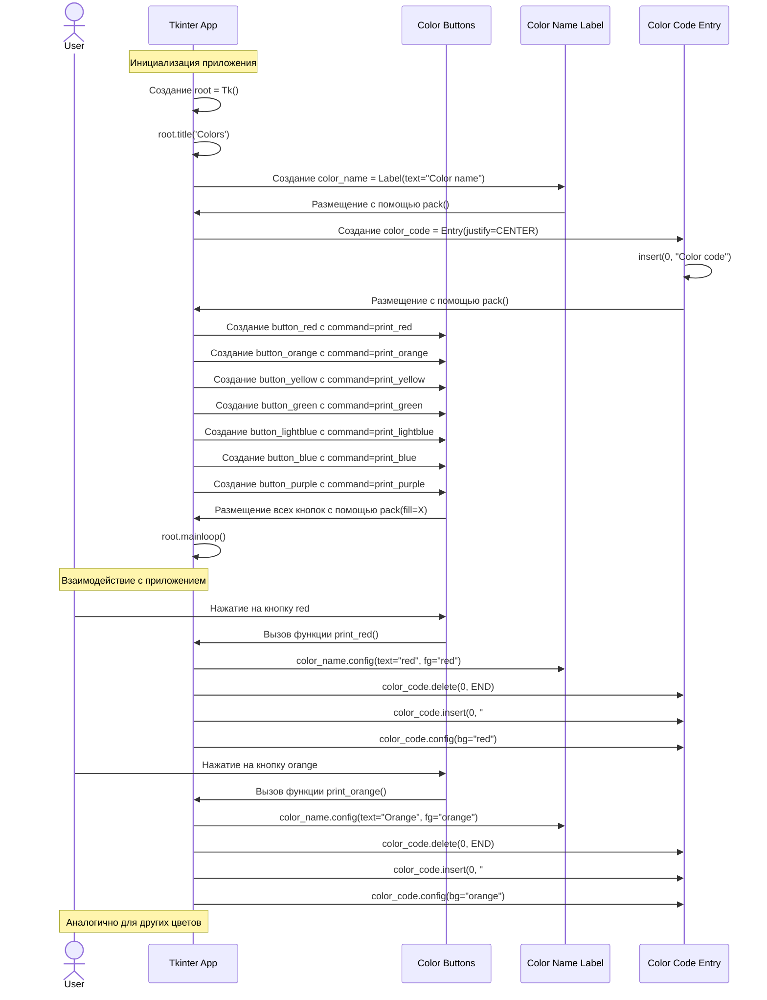

# Диаграмма последовательностей для процедурной версии app_rainbow.py

Эта диаграмма последовательностей описывает работу процедурной версии приложения Rainbow (строки 1-76 в файле app_rainbow.py).

## Описание процедурной версии приложения

Процедурная версия приложения Rainbow имеет следующую структуру и последовательность работы:

1. **Инициализация приложения**:
   - Создается главное окно приложения с помощью `Tk()`
   - Устанавливается заголовок окна: "Colors"
   - Создаются виджеты:
     - Label для отображения названия цвета
     - Entry для отображения кода цвета
     - Семь кнопок для разных цветов (red, orange, yellow, green, lightblue, blue, purple)

2. **Функции обработки цветов**:
   - Для каждого цвета создана отдельная функция (print_red, print_orange и т.д.)
   - Каждая функция выполняет одинаковые действия, но с разными значениями цвета:
     - Изменяет текст и цвет текста в Label
     - Очищает поле Entry
     - Вставляет в поле Entry код цвета в формате HEX
     - Изменяет фоновый цвет поля Entry

3. **Взаимодействие с пользователем**:
   - При нажатии на кнопку вызывается соответствующая функция
   - Функция обновляет информацию о выбранном цвете в интерфейсе

4. **Особенности процедурного подхода**:
   - Код содержит много повторений (для каждого цвета своя функция с похожим кодом)
   - Отсутствует инкапсуляция данных
   - Глобальные переменные используются внутри функций
   - Нет разделения на модель, представление и контроллер

Эта версия приложения демонстрирует простой процедурный подход к программированию, где логика приложения реализована через набор функций, работающих с глобальными переменными.