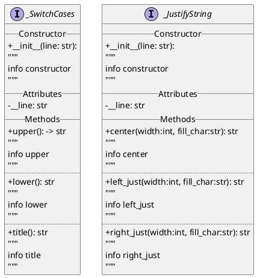

напиши код на py который преобразует plantuml в py код вот plantuml

код который должен получиться в результате и ты должен написать скрипт чтобы он такой же получился и скрипт должен сохранить этот код в файл .py:
```
from abc import ABC, abstractmethod


class _JustifyString(ABC):
    def __init__(self, line: str):
        """
        info constructor
        """
        self.__line = line

    @abstractmethod
    def center(self, width: int, fill_char: str) -> str:
        """
        info center
        """
        raise NotImplementedError()

    @abstractmethod
    def left_just(self, width: int, fill_char: str) -> str:
        """
        info left_just
        """
        raise NotImplementedError()
    
    @abstractmethod
    def right_just(self, width: int, fill_char: str) -> str:
        """
        info right_just
        """
        raise NotImplementedError()


class _SwitchCases(ABC):
    def __init__(self, line: str):
        """
        info constructor
        """
        self.__line = line

    @abstractmethod
    def upper(self) -> str:
        """
        info upper
        """
        raise NotImplementedError()

    @abstractmethod
    def lower(self) -> str:
        """
        info lower
        """
        raise NotImplementedError()
    
    @abstractmethod
    def title(self) -> str:
        """
        info title
        """
        raise NotImplementedError()
```