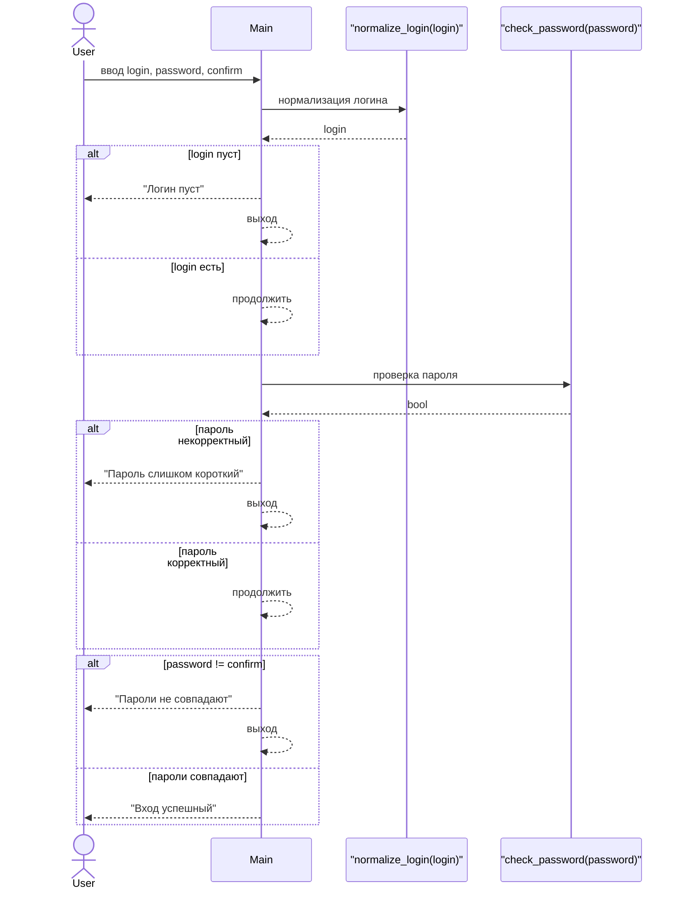

## Простая регистрация пользователя (без БД и API)

```python
def normalize_login(login: str) -> str:
    return login.strip().lower()


def check_password(password: str) -> bool:
    return len(password) >= 6


def main() -> None:
    login = input("Логин: ")
    password = input("Пароль: ")
    confirm = input("Подтверждение пароля: ")

    login = normalize_login(login)

    if not login:
        print("Логин пуст")
        return

    if not check_password(password):
        print("Пароль слишком короткий")
        return

    if password != confirm:
        print("Пароли не совпадают")
        return

    print("Вход успешный")


if __name__ == "__main__":
    main()
```


