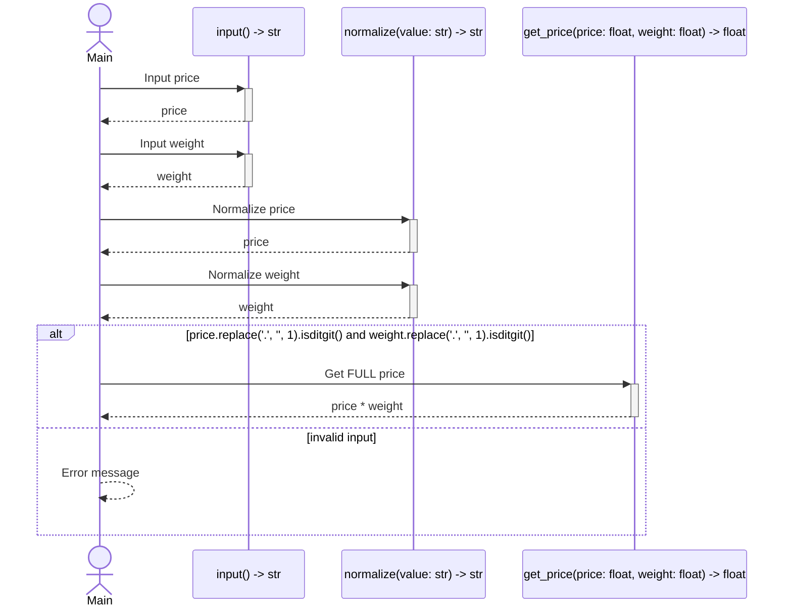

```mermaid
sequenceDiagram
    actor Main
    participant Input as input() -> str
    participant Normalize as normalize(value: str) -> str
    participant GetPrice as get_price(price: float, weight: float) -> float

    Main ->>+ Input: Input price
    Input -->>- Main: price

    Main ->>+ Input: Input weight
    Input -->>- Main: weight

    Main ->>+ Normalize: Normalize price
    Normalize -->>- Main: price

    Main ->>+ Normalize: Normalize weight
    Normalize -->>- Main: weight

    alt price.replace('.', '', 1).isditgit() and weight.replace('.', '', 1).isditgit()
        Main ->>+ GetPrice: Get FULL price
        GetPrice -->>- Main: price * weight
    else invalid input
        Main -->> Main: Error message
    end
``` 