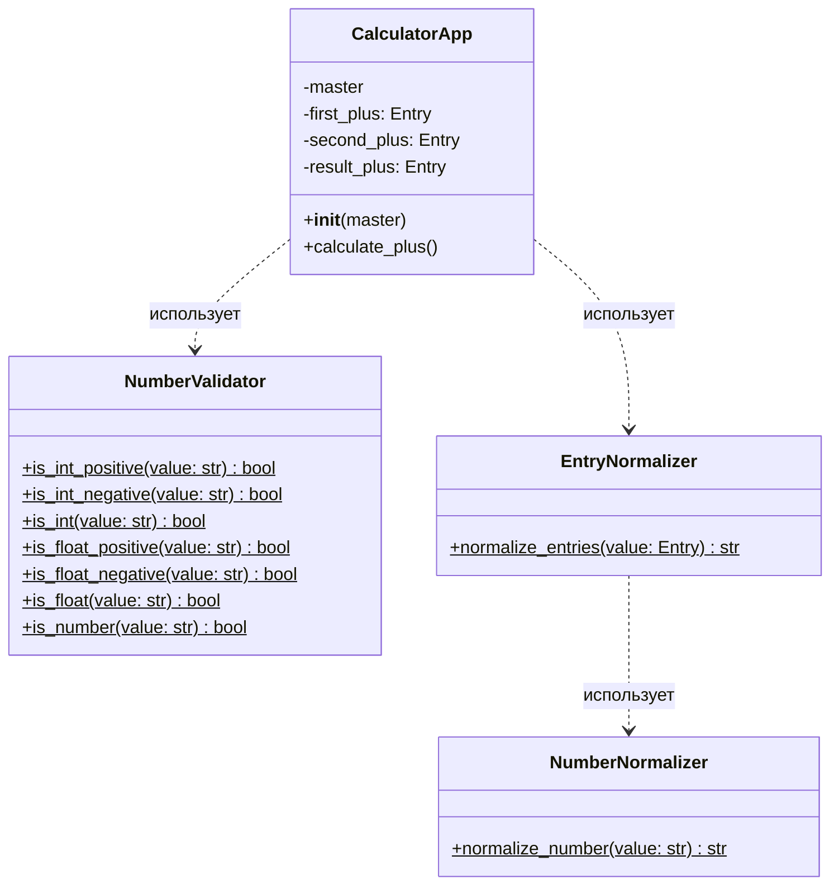

# Диаграмма классов для калькулятора

## Описание классов

### NumberValidator
Статический класс для проверки корректности числовых значений. Содержит методы для проверки целых и дробных чисел, положительных и отрицательных значений.

### NumberNormalizer
Статический класс для нормализации строкового представления чисел. Удаляет пробелы и заменяет запятые на точки.

### EntryNormalizer
Статический класс для нормализации значений из полей ввода (Entry). Использует NumberNormalizer для обработки текста.

### CalculatorApp
Основной класс приложения. Создает пользовательский интерфейс и обрабатывает взаимодействие с пользователем.