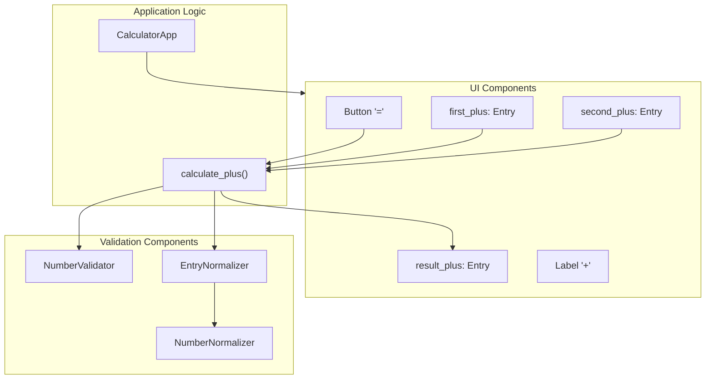

# Диаграмма компонентов для калькулятора

## Описание компонентов

### UI Components
- **first_plus**: Поле ввода для первого операнда
- **second_plus**: Поле ввода для второго операнда
- **result_plus**: Поле вывода результата
- **CalcButton**: Кнопка "=" для выполнения операции
- **PlusLabel**: Метка "+" между полями ввода

### Validation Components
- **NumberValidator**: Компонент для проверки корректности числовых значений
- **NumberNormalizer**: Компонент для нормализации строкового представления чисел
- **EntryNormalizer**: Компонент для нормализации значений из полей ввода

### Application Logic
- **CalculatorApp**: Основной компонент приложения
- **calculate_plus()**: Функция для выполнения операции сложения