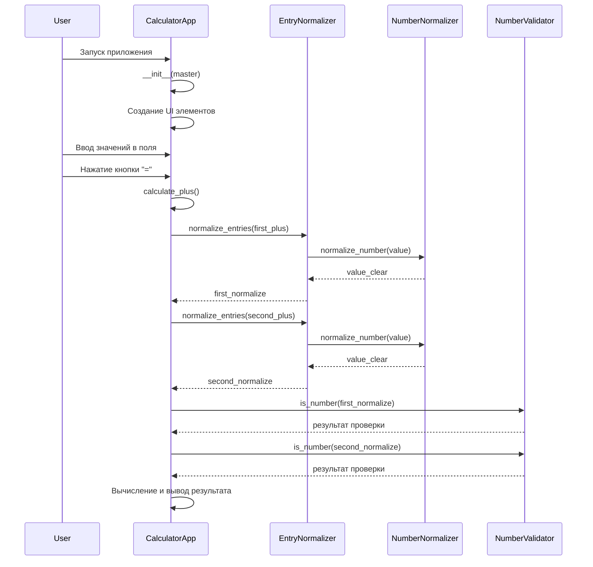

# Диаграмма последовательности для калькулятора

## Описание последовательности действий

1. Пользователь запускает приложение
2. Создается экземпляр CalculatorApp, который инициализирует интерфейс
3. Пользователь вводит значения в поля ввода
4. Пользователь нажимает кнопку "="
5. Вызывается метод calculate_plus()
6. Происходит нормализация введенных значений через EntryNormalizer
7. EntryNormalizer использует NumberNormalizer для очистки строк
8. Проверяется корректность значений через NumberValidator
9. Если значения корректны, выполняется сложение и результат выводится в поле результата
10. Если значения некорректны, выводится сообщение об ошибке