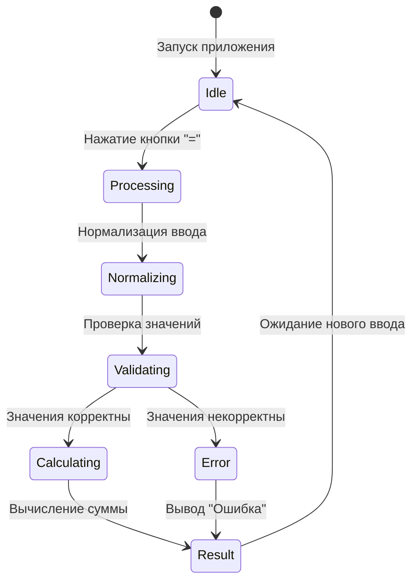

# Диаграмма состояний для калькулятора

## Описание состояний

1. **Idle** - Начальное состояние приложения после запуска. Ожидание ввода данных пользователем.
2. **Processing** - Состояние обработки запроса после нажатия кнопки "=".
3. **Normalizing** - Состояние нормализации введенных данных (удаление пробелов, замена запятых на точки).
4. **Validating** - Состояние проверки корректности введенных значений.
5. **Calculating** - Состояние вычисления результата при корректных входных данных.
6. **Error** - Состояние обработки ошибки при некорректных входных данных.
7. **Result** - Состояние отображения результата (числа или сообщения об ошибке).

После отображения результата приложение возвращается в состояние ожидания (Idle) для нового ввода.