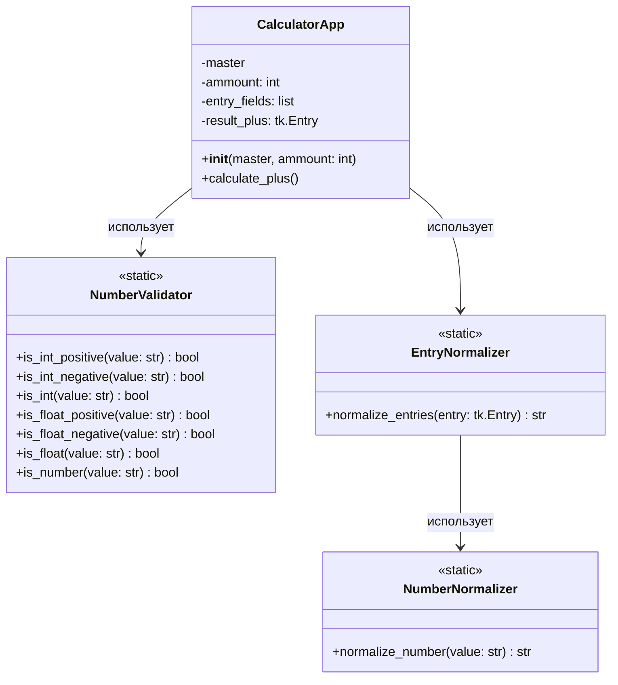

```mermaid
classDiagram
    class NumberValidator {
        <<static>>
        +is_int_positive(value: str) bool
        +is_int_negative(value: str) bool
        +is_int(value: str) bool
        +is_float_positive(value: str) bool
        +is_float_negative(value: str) bool
        +is_float(value: str) bool
        +is_number(value: str) bool
    }
    
    class NumberNormalizer {
        <<static>>
        +normalize_number(value: str) str
    }
    
    class EntryNormalizer {
        <<static>>
        +normalize_entries(entry: tk.Entry) str
    }
    
    class CalculatorApp {
        -master
        -ammount: int
        -entry_fields: list
        -result_plus: tk.Entry
        +__init__(master, ammount: int)
        +calculate_plus()
    }
    
    EntryNormalizer --> NumberNormalizer : использует
    CalculatorApp --> EntryNormalizer : использует
    CalculatorApp --> NumberValidator : использует
```