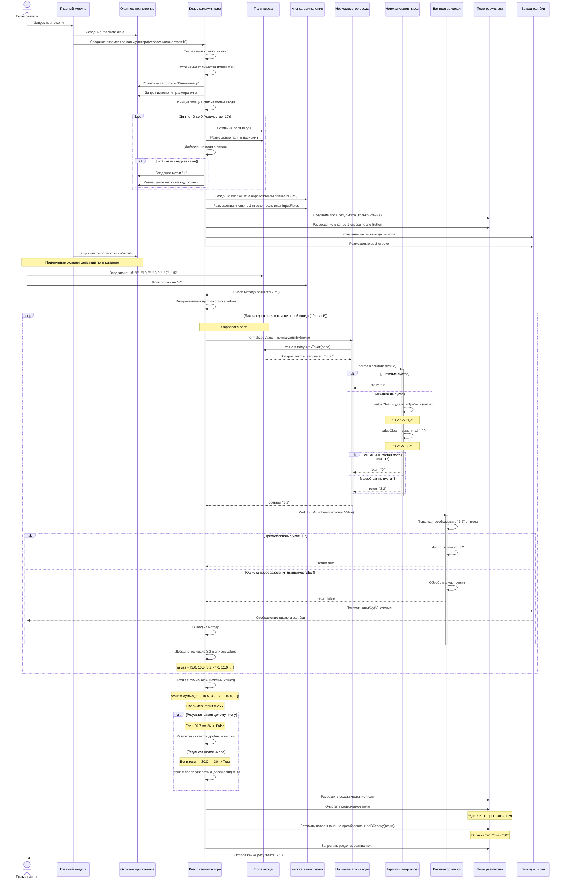

# Диаграмма последовательности для калькулятора

## Описание последовательности действий

1. Пользователь запускает приложение
2. Создается экземпляр CalculatorApp, который инициализирует интерфейс
3. Пользователь вводит значения в поля ввода
4. Пользователь нажимает кнопку "= и вызывается метод calculate_plus()
5. Происходит нормализация введенных значений через EntryNormalizer
6. EntryNormalizer использует NumberNormalizer для очистки строк
7. Проверяется корректность значений через NumberValidator
8. Если значения корректны, выполняется сложение и результат выводится в поле результата
9. Если значения некорректны, выводится сообщение об ошибке