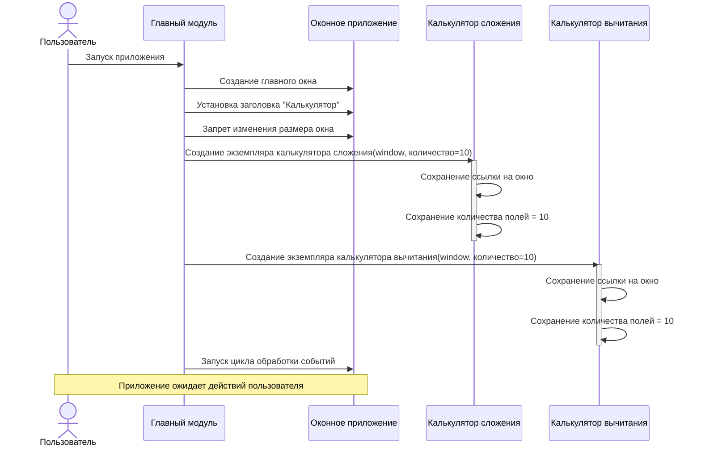
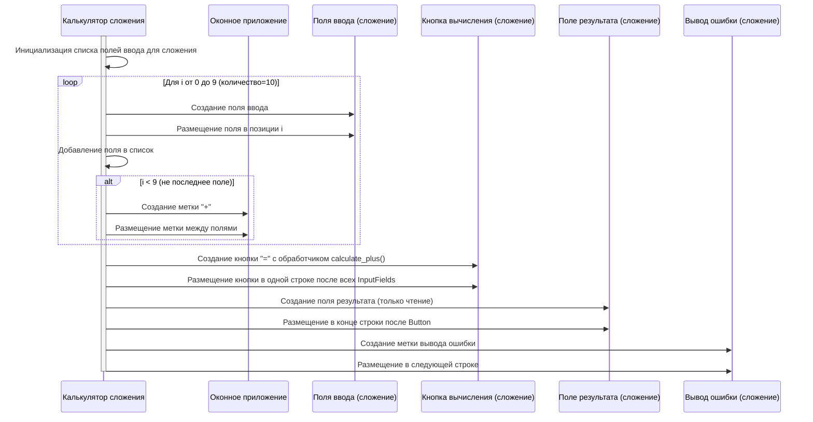
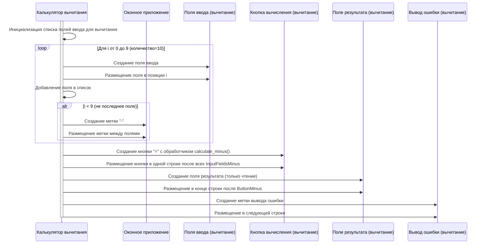
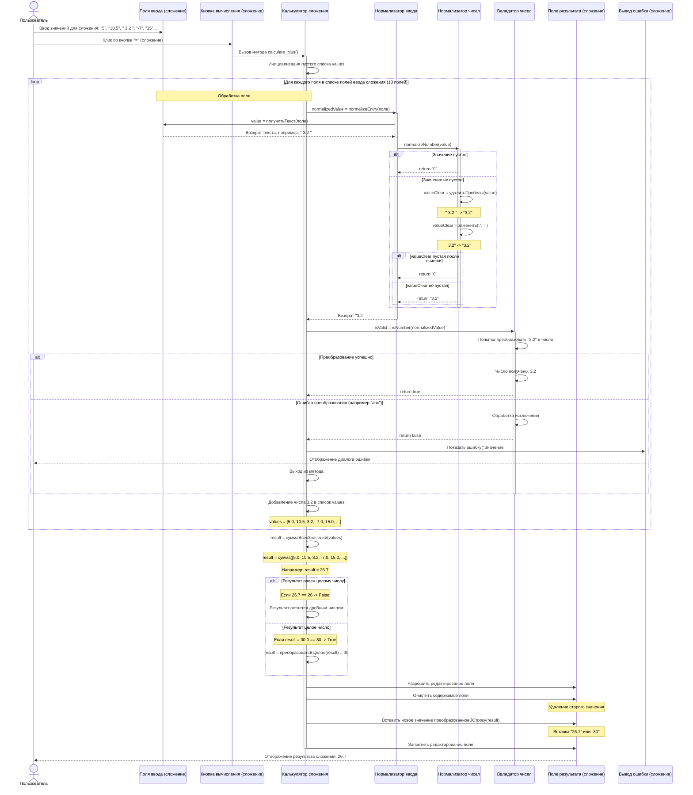
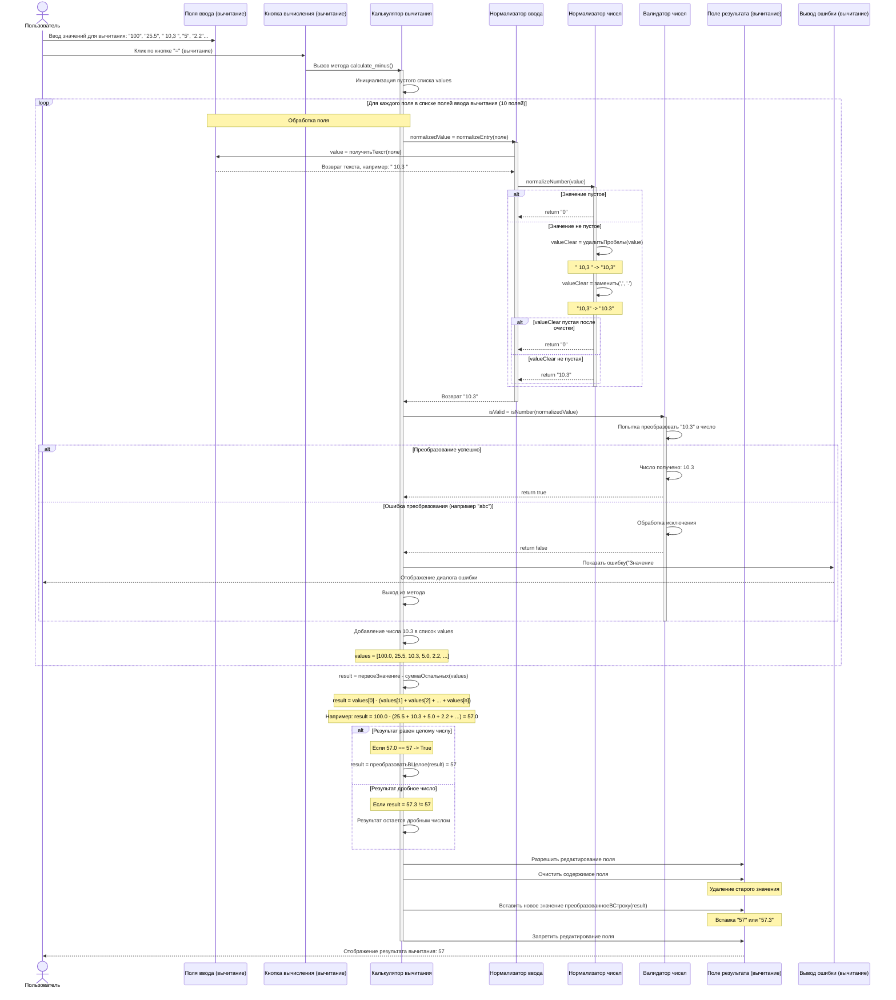

# Диаграмма последовательности для калькулятора

## Часть 1: Инициализация приложения

## Часть 2: Создание интерфейса для операции сложения

## Часть 3: Создание интерфейса для операции вычитания

## Часть 4: Обработка операции сложения

## Часть 5: Обработка операции вычитания

## Описание последовательности действий

### Инициализация (Часть 1)
1. Пользователь запускает приложение
2. Создается главное окно
3. **Создается первый экземпляр CalculatorApp для сложения** (AppPlus)
4. **Создается второй экземпляр CalculatorApp для вычитания** (AppMinus)
5. Настраиваются базовые параметры окна

### Создание интерфейса сложения (Часть 2)
1. **Экземпляр AppPlus** создает 10 полей ввода с метками "+" между ними
2. Добавляется кнопка "=" с обработчиком calculate_plus()
3. Создается поле результата и метка ошибки для сложения

### Создание интерфейса вычитания (Часть 3)
1. **Экземпляр AppMinus** создает 10 полей ввода с метками "-" между ними
2. Добавляется кнопка "=" с обработчиком calculate_minus()
3. Создается поле результата и метка ошибки для вычитания

### Обработка сложения (Часть 4)
1. Пользователь вводит значения в поля сложения и нажимает кнопку "="
2. **Экземпляр AppPlus** обрабатывает запрос через calculate_plus()
3. Происходит нормализация через EntryNormalizer и NumberNormalizer
4. Валидация значений через NumberValidator
5. Вычисление суммы всех значений
6. Вывод результата в поле результата сложения

### Обработка вычитания (Часть 5)
1. Пользователь вводит значения в поля вычитания и нажимает кнопку "="
2. **Экземпляр AppMinus** обрабатывает запрос через calculate_minus()
3. Происходит нормализация через EntryNormalizer и NumberNormalizer
4. Валидация значений через NumberValidator
5. Вычисление: первое значение минус сумма остальных
6. Вывод результата в поле результата вычитания