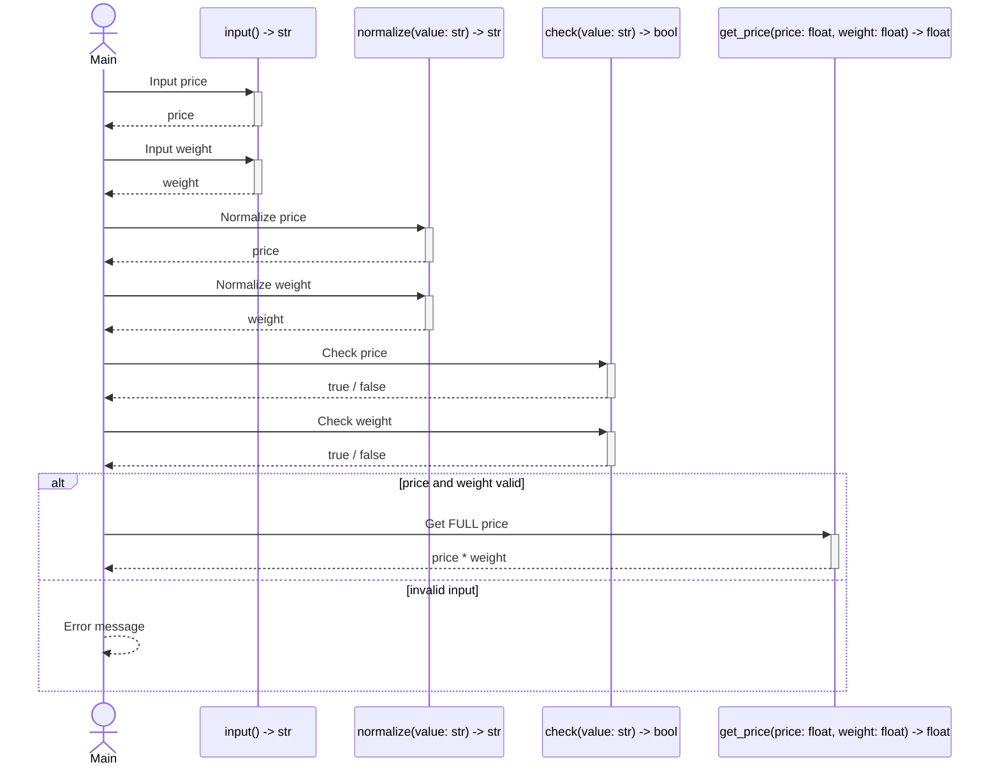
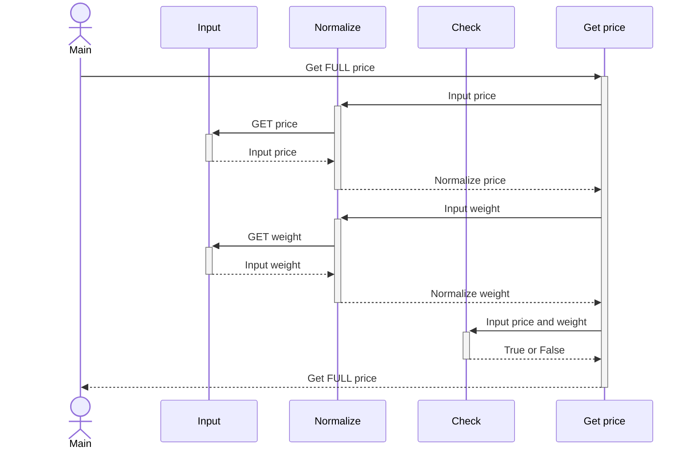

# Sequence diagram 

```mermaid
sequenceDiagram
    actor Main
    participant Input as input() -> str
    participant Normalize as normalize(value: str) -> str 
    participant Check as check(value: str) -> bool
    participant Get price as get_price(price: float, weight: float) -> float
    Main ->>+ Input: Input price
    Input -->>- Main: price
    Main ->>+ Input: Input weight
    Input -->>- Main: weight
    Main ->>+ Normalize: Normalize price
    Normalize -->>- Main: price
    Main ->>+ Normalize: Normalize weight
    Normalize -->>- Main: weight
    Main ->>+ Get price: Get FULL price
    Get price ->>+ Check: Check price
    Get price ->>+ Check: Check weight
    alt Check
         Get price -->>- Main: price * weight
    else not Check
%%         Get price -->>- Main: Error message
    end
%%    Main ->>+ Check: Check price
%%    Check -->>- Main: price
%%    Main ->>+ Check: Check weight
%%    Check -->>- Main: weight
%%    Main ->>+ Get price: Get FULL price
%%    Get price -->>- Main: price * weight

```




# Sequence diagram 2 

