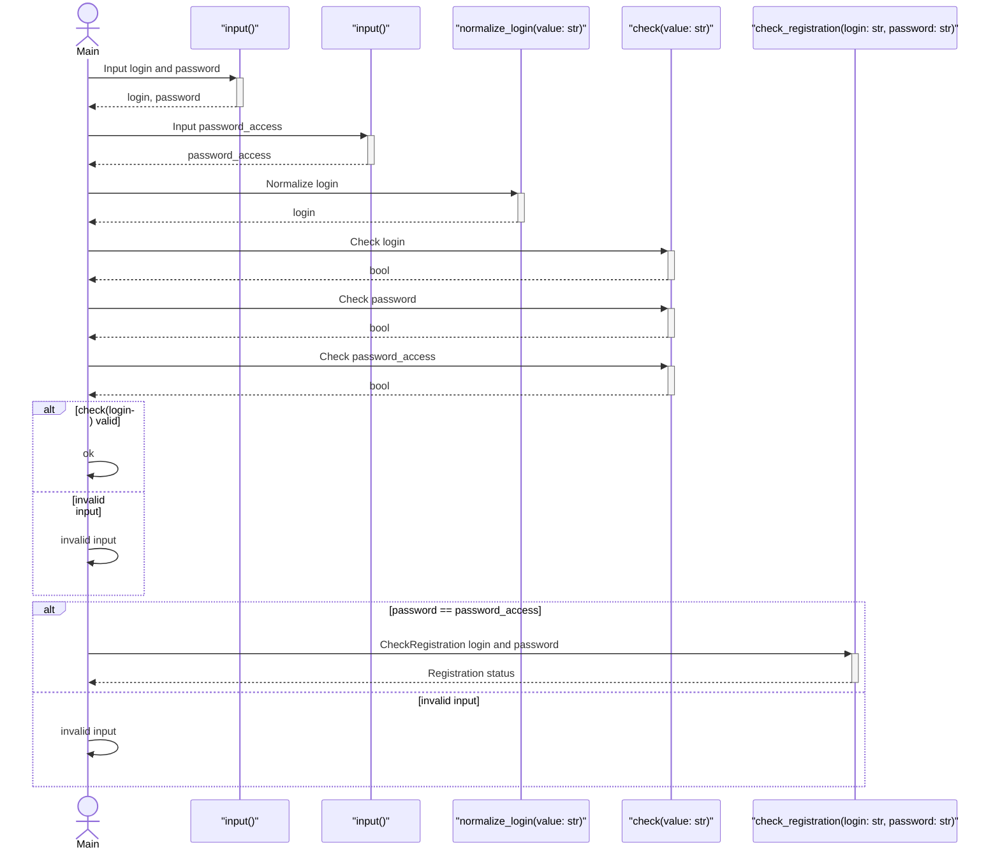

```mermaid
sequenceDiagram
    actor Main
    participant Input as "input()"
    participant Input_access as "input()"
    participant Normalize as "normalize_login(value: str)"
    participant Check as "check(value: str)"
    participant CheckRegistration as "check_registration(login: str, password: str)"

    Main ->>+ Input: Input login and password
    Input -->>- Main: login, password

    Main ->>+ Input_access: Input password_access
    Input_access -->>- Main: password_access

    Main ->>+ Normalize: Normalize login
    Normalize -->>- Main: login

    Main ->>+ Check: Check login
    Check -->>- Main: bool

    Main ->>+ Check: Check password
    Check -->>- Main: bool

    Main ->>+ Check: Check password_access
    Check -->>- Main: bool

    alt check(login) valid
        Main ->> Main: ok
    else invalid input
        Main ->> Main: invalid input
    end

    alt password == password_access
        Main ->>+ CheckRegistration: CheckRegistration login and password
        CheckRegistration -->>- Main: Registration status
    else invalid input
        Main ->> Main: invalid input
    end
```
