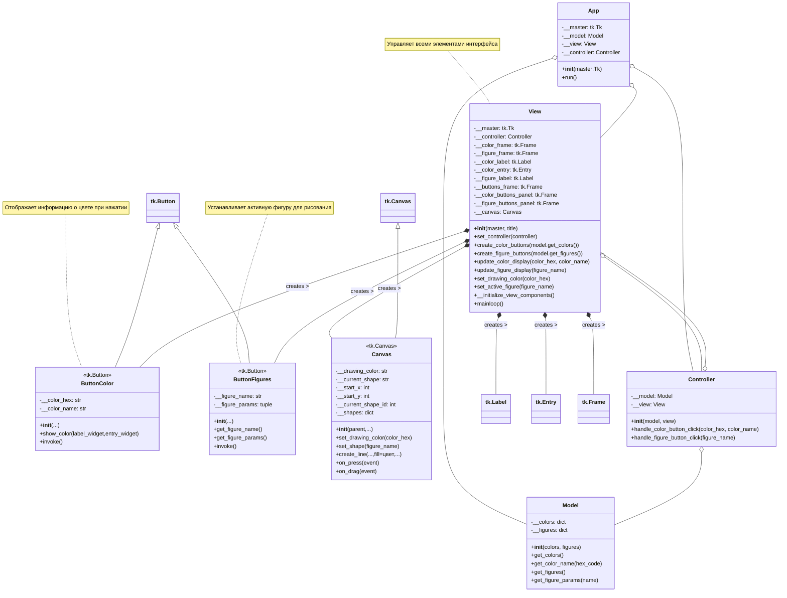

```mermaid
classDiagram
    class Model {
        -__colors: dict
        -__figures: dict
        +__init__(colors, figures)
        +get_colors()
        +get_color_name(hex_code)
        +get_figures()
        +get_figure_params(name)
    }

    class ButtonColor {
        <<tk.Button>>
        -__color_hex: str
        -__color_name: str
        +__init__(...)
        +show_color(label_widget,entry_widget)
        +invoke()
    }

    class ButtonFigures {
        <<tk.Button>>
        -__figure_name: str
        -__figure_params: tuple
        +__init__(...)
        +get_figure_name()
        +get_figure_params()
        +invoke()
    }

    class View {
        -__master: tk.Tk
        -__controller: Controller
        -__color_frame: tk.Frame
        -__figure_frame: tk.Frame
        -__color_label: tk.Label
        -__color_entry: tk.Entry
        -__figure_label: tk.Label
        -__buttons_frame: tk.Frame
        -__color_buttons_panel: tk.Frame
        -__figure_buttons_panel: tk.Frame
        -__canvas: Canvas
        +__init__(master, title)
        +set_controller(controller)
        +create_color_buttons(model.get_colors())
        +create_figure_buttons(model.get_figures())
        +update_color_display(color_hex, color_name)
        +update_figure_display(figure_name)
        +set_drawing_color(color_hex)
        +set_active_figure(figure_name)
        +__initialize_view_components()
        +mainloop()
    }

    class Canvas {
        <<tk.Canvas>>
        -__drawing_color: str
        -__current_shape: str
        -__start_x: int
        -__start_y: int
        -__current_shape_id: int
        -__shapes: dict
        +__init__(parent,...)
        +set_drawing_color(color_hex)
        +set_shape(figure_name)
        +create_line(...,fill=цвет,...)
        +on_press(event)
        +on_drag(event)
    }

    class Controller {
        -__model: Model
        -__view: View
        +__init__(model, view)
        +handle_color_button_click(color_hex, color_name)
        +handle_figure_button_click(figure_name)
    }

    class App {
        -__master: tk.Tk
        -__model: Model
        -__view: View
        -__controller: Controller
        +__init__(master:Tk)
        +run()
    }

    tk.Button <|-- ButtonColor
    tk.Button <|-- ButtonFigures
    App o-- Model
    App o-- View
    App o-- Controller
    Controller o-- Model
    Controller o-- View
    View o-- Controller
    View *-- ButtonColor : creates >
    View *-- ButtonFigures : creates >
    View *-- Canvas : creates >
    tk.Canvas <|-- Canvas
    View *-- tk.Label : creates >
    View *-- tk.Entry : creates >
    View *-- tk.Frame : creates >

    note for ButtonColor "Отображает информацию о цвете при нажатии"
    note for ButtonFigures "Устанавливает активную фигуру для рисования"
    note for View "Управляет всеми элементами интерфейса"
```