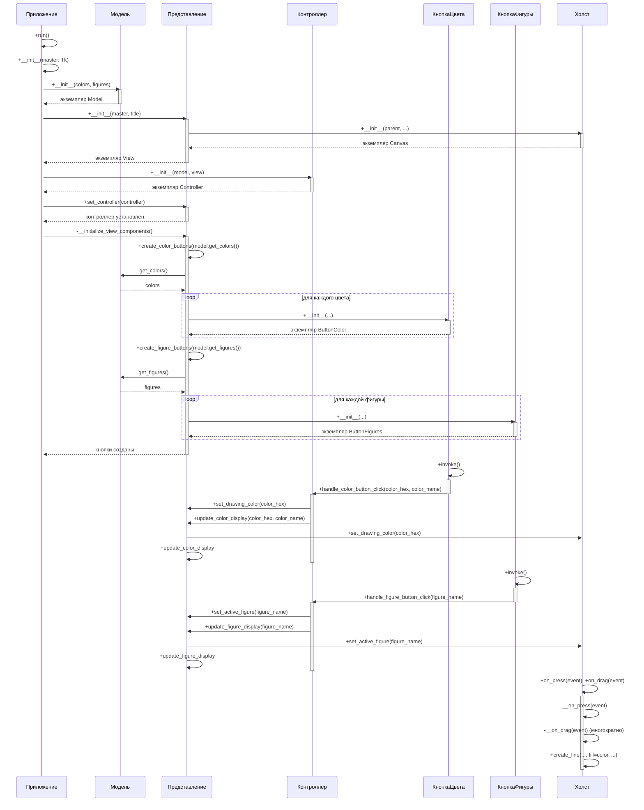

```mermaid
sequenceDiagram

    
    participant App as Приложение
    participant Model as Модель
    participant View as Представление
    participant Controller as Контроллер
    participant ButtonColor as КнопкаЦвета
    participant ButtonFigures as КнопкаФигуры
    participant Canvas as Холст

    %% Инициализация приложения
    App->>App: +run()
    activate App
    App->>App: +__init__(master: Tk)
    App->>Model: +__init__(colors, figures)
    activate Model
    Model-->>App: экземпляр Model
    deactivate Model

    App->>View: +__init__(master, title)
    activate View
    View->>Canvas: +__init__(parent, ...)
    activate Canvas
    Canvas-->>View: экземпляр Canvas
    deactivate Canvas
    View-->>App: экземпляр View
    deactivate View

    App->>Controller: +__init__(model, view)
    activate Controller
    Controller-->>App: экземпляр Controller
    deactivate Controller

    App->>View: +set_controller(controller)
    activate View
    View-->>App: контроллер установлен
    deactivate View

    App->>View: -__initialize_view_components()
    activate View
    View->>View: +create_color_buttons(model.get_colors())
    View->>Model: get_colors()
    Model-->>View: colors
    loop для каждого цвета
        View->>ButtonColor: +__init__(...)
        activate ButtonColor
        ButtonColor-->>View: экземпляр ButtonColor
        deactivate ButtonColor
    end
    View->>View: +create_figure_buttons(model.get_figures())
    View->>Model: get_figures()
    Model-->>View: figures
    loop для каждой фигуры
        View->>ButtonFigures: +__init__(...)
        activate ButtonFigures
        ButtonFigures-->>View: экземпляр ButtonFigures
        deactivate ButtonFigures
    end
    View-->>App: кнопки созданы
    deactivate View

    %% Выбор цвета
    ButtonColor->>ButtonColor: +invoke()
    activate ButtonColor
    ButtonColor->>Controller: +handle_color_button_click(color_hex, color_name)
    deactivate ButtonColor
    activate Controller
    Controller->>View: +set_drawing_color(color_hex)
    Controller->>View: +update_color_display(color_hex, color_name)
    View->>Canvas: +set_drawing_color(color_hex)
    View->>View: +update_color_display
    deactivate Controller

    %% Выбор фигуры
    ButtonFigures->>ButtonFigures: +invoke()
    activate ButtonFigures
    ButtonFigures->>Controller: +handle_figure_button_click(figure_name)
    deactivate ButtonFigures
    activate Controller
    Controller->>View: +set_active_figure(figure_name)
    Controller->>View: +update_figure_display(figure_name)
    View->>Canvas: +set_active_figure(figure_name)
    View->>View: +update_figure_display
    deactivate Controller

    %% Рисование фигуры мышью
    Canvas->>Canvas: +on_press(event), +on_drag(event)
    activate Canvas
    Canvas->>Canvas: -__on_press(event)
    Canvas->>Canvas: -__on_drag(event) (многократно)
    Canvas->>Canvas: +create_line(..., fill=color, ...)

    deactivate Canvas
```
