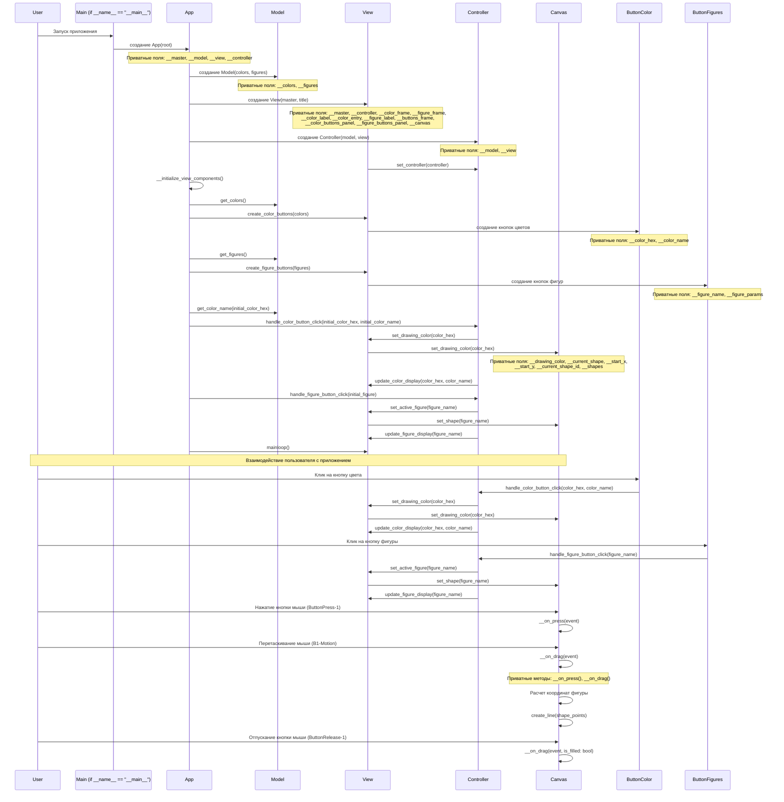

# Sequence Diagram для Rainbow Star MVC Paint

```mermaid
sequenceDiagram
    participant User
    participant Main as Main (if __name__ == "__main__")
    participant App
    participant Model
    participant View
    participant Controller
    participant Canvas
    participant ButtonColor
    participant ButtonFigures
    
    User->>Main: Запуск приложения
    Main->>App: создание App(root)
    
    Note over App: Приватные поля: __master, __model, __view, __controller
    App->>Model: создание Model(colors, figures)
    Note over Model: Приватные поля: __colors, __figures
    
    App->>View: создание View(master, title)
    Note over View: Приватные поля: __master, __controller, __color_frame, __figure_frame,<br>__color_label, __color_entry, __figure_label, __buttons_frame,<br>__color_buttons_panel, __figure_buttons_panel, __canvas
    
    App->>Controller: создание Controller(model, view)
    Note over Controller: Приватные поля: __model, __view
    
    View->>Controller: set_controller(controller)
    
    App->>App: __initialize_view_components()
    App->>Model: get_colors()
    App->>View: create_color_buttons(colors)
    View->>ButtonColor: создание кнопок цветов
    Note over ButtonColor: Приватные поля: __color_hex, __color_name
    
    App->>Model: get_figures()
    App->>View: create_figure_buttons(figures)
    View->>ButtonFigures: создание кнопок фигур
    Note over ButtonFigures: Приватные поля: __figure_name, __figure_params
    
    App->>Model: get_color_name(initial_color_hex)
    App->>Controller: handle_color_button_click(initial_color_hex, initial_color_name)
    Controller->>View: set_drawing_color(color_hex)
    View->>Canvas: set_drawing_color(color_hex)
    Note over Canvas: Приватные поля: __drawing_color, __current_shape, __start_x,<br>__start_y, __current_shape_id, __shapes
    
    Controller->>View: update_color_display(color_hex, color_name)
    
    App->>Controller: handle_figure_button_click(initial_figure)
    Controller->>View: set_active_figure(figure_name)
    View->>Canvas: set_shape(figure_name)
    Controller->>View: update_figure_display(figure_name)
    
    App->>View: mainloop()
    
    Note over User, Canvas: Взаимодействие пользователя с приложением
    
    User->>ButtonColor: Клик на кнопку цвета
    ButtonColor->>Controller: handle_color_button_click(color_hex, color_name)
    Controller->>View: set_drawing_color(color_hex)
    View->>Canvas: set_drawing_color(color_hex)
    Controller->>View: update_color_display(color_hex, color_name)
    
    User->>ButtonFigures: Клик на кнопку фигуры
    ButtonFigures->>Controller: handle_figure_button_click(figure_name)
    Controller->>View: set_active_figure(figure_name)
    View->>Canvas: set_shape(figure_name)
    Controller->>View: update_figure_display(figure_name)
    
    User->>Canvas: Нажатие кнопки мыши (ButtonPress-1)
    Canvas->>Canvas: __on_press(event)
    User->>Canvas: Перетаскивание мыши (B1-Motion)
    Canvas->>Canvas: __on_drag(event)
    Note over Canvas: Приватные методы: __on_press(), __on_drag()
    Canvas->>Canvas: Расчет координат фигуры
    Canvas->>Canvas: create_line(shape_points)
    User->>Canvas: Отпускание кнопки мыши (ButtonRelease-1)
    Canvas->>Canvas: __on_drag(event, is_filled: bool)
```