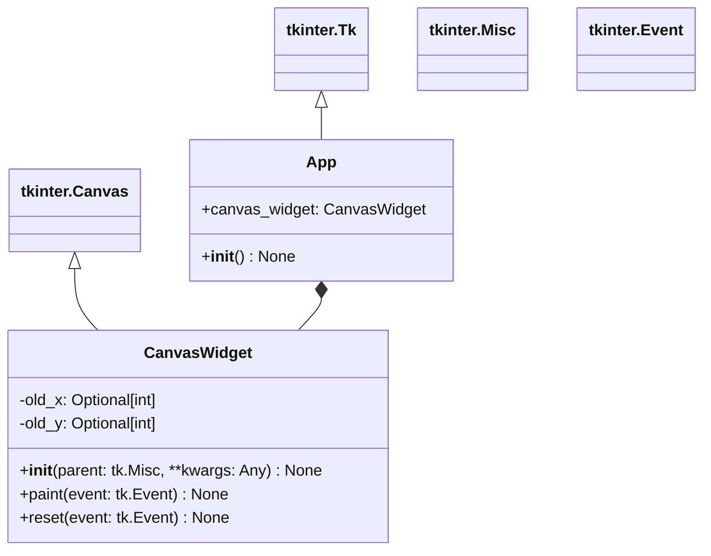

```mermaid
classDiagram
    class tkinter.Canvas
    class tkinter.Tk
    class tkinter.Misc
    class tkinter.Event

    class CanvasWidget {
        -old_x: Optional[int]
        -old_y: Optional[int]
        +__init__(parent: tk.Misc, **kwargs: Any) None
        +paint(event: tk.Event) None
        +reset(event: tk.Event) None
    }

    class App {
        +canvas_widget: CanvasWidget
        +__init__() None
    }

    tkinter.Canvas <|-- CanvasWidget
    tkinter.Tk <|-- App
    App *-- CanvasWidget
```