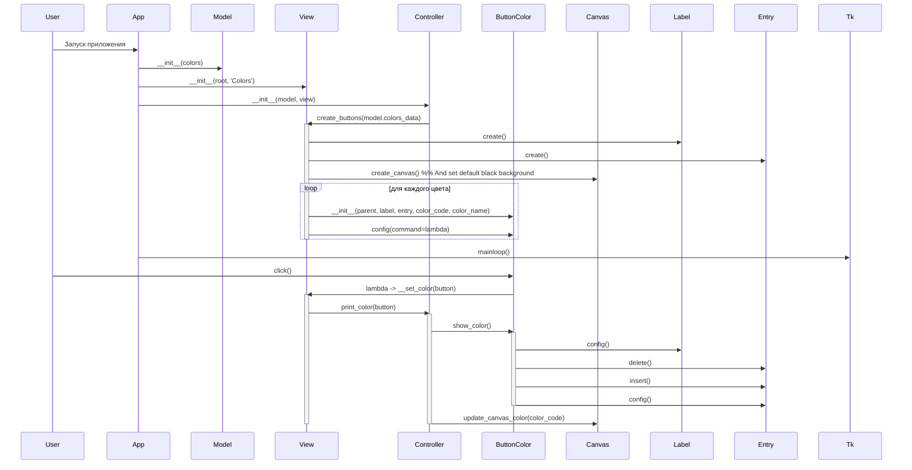
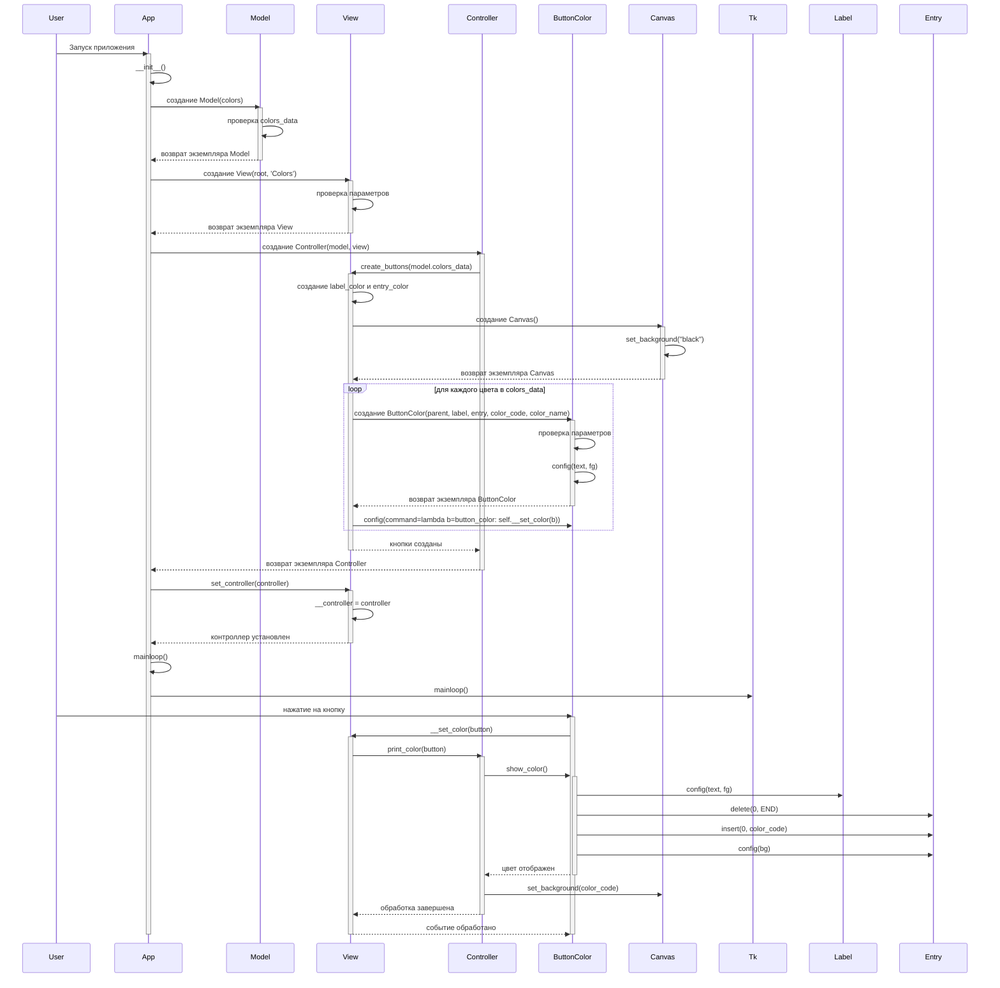

# Диаграмма последовательностей для приложения Rainbow

Ниже представлена диаграмма последовательностей, отображающая взаимодействие между компонентами приложения Rainbow (app_rainbow.py).

## Описание диаграммы последовательностей

Диаграмма последовательностей отображает взаимодействие между компонентами приложения Rainbow, реализованного с использованием архитектурного паттерна MVC (Model-View-Controller).

### Инициализация приложения

1. **Запуск приложения**: Пользователь запускает приложение, что приводит к созданию экземпляра класса `App`.
2. **Создание Model**: Создается экземпляр класса `Model` с передачей словаря цветов `colors`.
3. **Создание View**: Создается экземпляр класса `View` с передачей корневого окна и названия метки.
4. **Создание Controller**: Создается экземпляр класса `Controller` с передачей созданных экземпляров `Model` и `View`.
5. **Создание кнопок**: Контроллер вызывает метод `create_buttons` у представления, передавая данные о цветах из модели.

### Создание компонентов View и кнопок

1. Представление (`View`) создает метку (`Label`) и поле ввода (`Entry`).
2. Представление (`View`) также создает холст (`Canvas`), который по умолчанию имеет черный фон для рисования.
3. Для каждого цвета в словаре цветов создается экземпляр класса `ButtonColor`.
4. Каждой кнопке назначается обработчик события, который будет вызывать метод `__set_color` при нажатии.

### Установка контроллера

1. Экземпляр контроллера устанавливается в представление через метод `set_controller`.
2. Запускается главный цикл обработки событий приложения через метод `mainloop()`.

### Обработка нажатия на кнопку

1. Пользователь нажимает на кнопку цвета.
2. Вызывается метод `__set_color` у представления.
3. Представление вызывает метод `print_color` у контроллера, передавая нажатую кнопку.
4. Контроллер вызывает метод `show_color` у кнопки.
5. Кнопка обновляет текст и цвет метки, а также содержимое и цвет фона поля ввода.
6. Контроллер также обновляет цвет фона холста (`Canvas`) на выбранный цвет, позволяя "рисовать" этим цветом.

Таким образом, приложение реализует паттерн MVC, где:
- `Model` отвечает за данные (словарь цветов).
- `View` отвечает за отображение (создание и размещение виджетов).
- `Controller` отвечает за логику взаимодействия между моделью и представлением.
- `ButtonColor` является специализированным виджетом, расширяющим стандартную кнопку Tkinter.