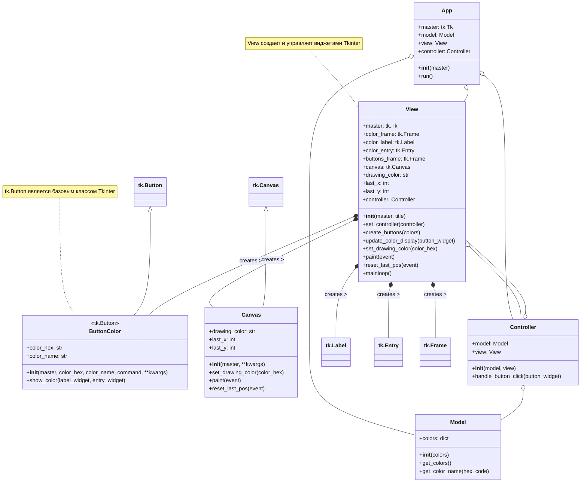
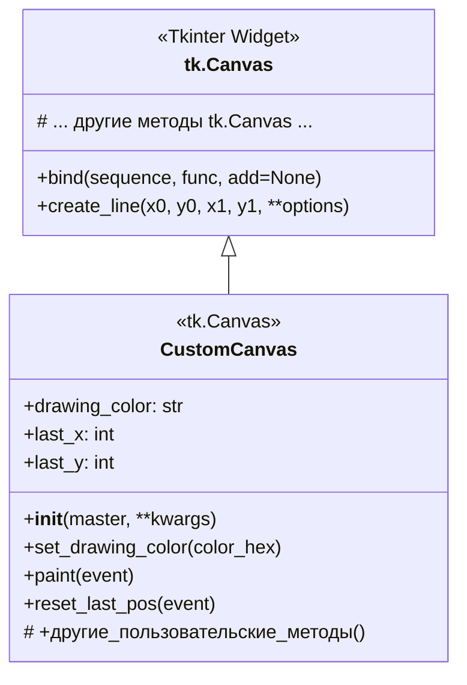

# Диаграмма классов для app_rainbow_mvc.py

## Описание диаграммы классов

Эта диаграмма классов отображает структуру приложения `app_rainbow_mvc.py`, реализованного с использованием архитектурного паттерна MVC (Model-View-Controller) и библиотеки Tkinter для графического интерфейса.

- **`Model`**: Отвечает за хранение данных приложения, в данном случае — словаря цветов.
- **`ButtonColor`**: Специализированный класс кнопки, наследуемый от `tk.Button`. Каждая кнопка представляет определенный цвет и содержит логику для отображения информации о цвете.
- **`View`**: Отвечает за представление данных и пользовательский интерфейс. Создает и управляет всеми виджетами окна, включая метки, поля ввода, кнопки цветов (`ButtonColor`) и холст (`tk.Canvas`) для рисования. Содержит ссылку на `Controller`.
- **`Controller`**: Связующее звено между `Model` и `View`. Обрабатывает действия пользователя (например, нажатие кнопки) и обновляет `View` на основе данных из `Model`.
- **`App`**: Основной класс приложения, который инициализирует `Model`, `View` и `Controller`, а также запускает главный цикл приложения.

### Отношения между классами:
- **Наследование (`<|--`)**: `ButtonColor` наследуется от `tk.Button`.
- **Агрегация (`o--`)**: `App` содержит экземпляры `Model`, `View` и `Controller`. `Controller` содержит экземпляры `Model` и `View`. `View` содержит экземпляр `Controller` (устанавливается после инициализации).
- **Композиция (`*--`)**: `View` создает и владеет экземплярами `ButtonColor`, `tk.Canvas`, `tk.Label`, `tk.Entry` и `tk.Frame`. Это означает, что жизненный цикл этих виджетов управляется `View`.

Диаграмма также включает заметки для пояснения некоторых аспектов, например, что `tk.Button` является частью библиотеки Tkinter.

## Расширение `tk.Canvas` для пользовательской логики рисования

В приложении `app_rainbow_mvc.py` используется стандартный виджет `tk.Canvas` для рисования. Однако, для более сложной логики рисования или для инкапсуляции специфического поведения, связанного с холстом, может быть полезно создать собственный класс, унаследованный от `tk.Canvas`.

### Пример создания `CustomCanvas`

Рассмотрим, как можно было бы определить класс `CustomCanvas`:

**Описание `CustomCanvas`:**

-   **Наследование**: `CustomCanvas` наследуется от `tk.Canvas`, что означает, что он получает все стандартные возможности холста Tkinter.
-   **Атрибуты**:
    -   `drawing_color`: Хранит текущий цвет для рисования.
    -   `last_x`, `last_y`: Хранят координаты последней точки, чтобы рисовать непрерывные линии.
-   **Методы**:
    -   `__init__(master, **kwargs)`: Конструктор класса. Вызывает конструктор родительского класса `tk.Canvas` и может инициализировать пользовательские атрибуты.
    -   `set_drawing_color(color_hex)`: Устанавливает цвет рисования.
    -   `paint(event)`: Обработчик события движения мыши с зажатой кнопкой. Рисует линию от `(last_x, last_y)` до текущих координат мыши `(event.x, event.y)` используя `drawing_color`. Затем обновляет `last_x` и `last_y`.
    -   `reset_last_pos(event)`: Обработчик события отпускания кнопки мыши. Сбрасывает `last_x` и `last_y`, чтобы следующая линия начиналась с новой точки.
    -   `# +другие_пользовательские_методы()`: Здесь могут быть добавлены другие методы для расширения функциональности, например, изменение толщины линии, выбор инструмента рисования и т.д.

### Преимущества наследования `tk.Canvas`

1.  **Инкапсуляция**: Логика, специфичная для рисования (управление цветом, состоянием кисти, обработка событий мыши для рисования), инкапсулируется внутри класса `CustomCanvas`. Это делает класс `View` чище, так как он делегирует эти задачи `CustomCanvas`.
2.  **Расширяемость**: Легко добавлять новую функциональность (например, разные инструменты рисования, стили линий, отмена/повтор действий) непосредственно в класс `CustomCanvas`, не усложняя другие части приложения.
3.  **Переиспользование**: Если подобный холст с расширенной функциональностью потребуется в другом приложении или другой части этого же приложения, класс `CustomCanvas` можно будет легко переиспользовать.
4.  **Читаемость кода**: Код становится более структурированным и понятным, так как ответственность за функциональность холста четко определена.

В текущей реализации `app_rainbow_mvc.py` методы `paint`, `reset_last_pos` и атрибуты `drawing_color`, `last_x`, `last_y` находятся в классе `View`. Перенос их в специализированный класс `CustomCanvas` (который затем будет использоваться в `View`) является хорошей практикой для улучшения архитектуры.
