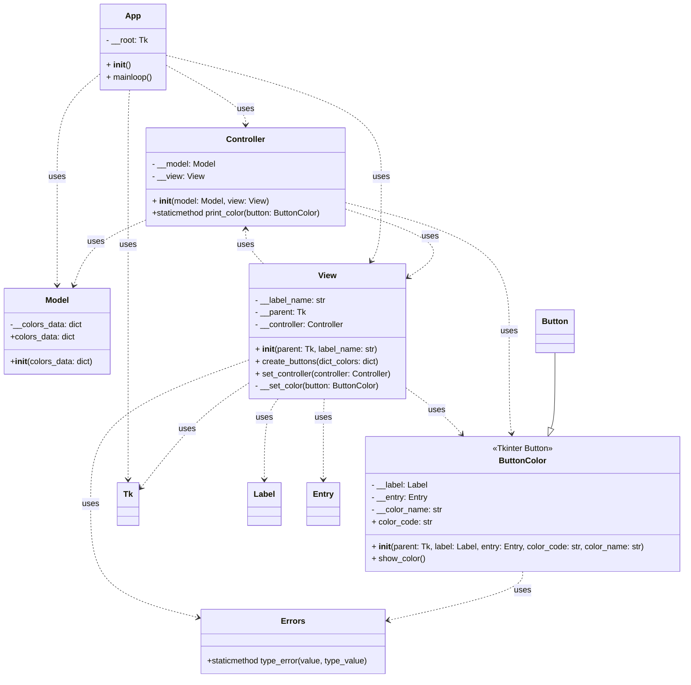

# Диаграмма классов для app_rainbow.py

**Примечание:** Классы и методы в коде `app_rainbow.py` теперь содержат строки документации (docstrings), описывающие их назначение и параметры. Диаграмма ниже показывает структуру классов.

