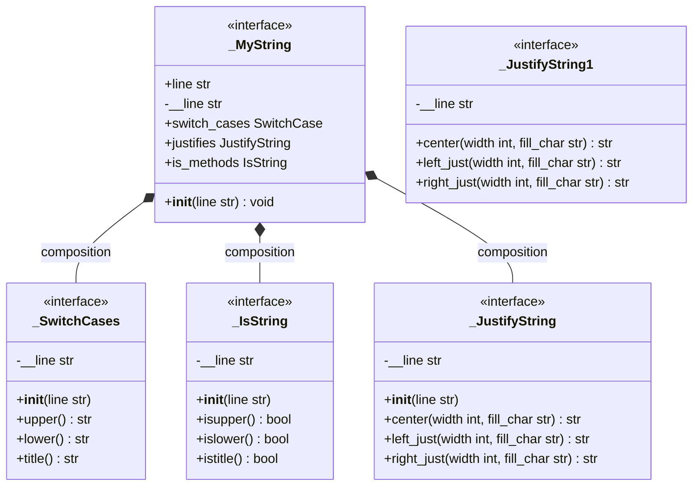

# Объединенная диаграмма классов

# `_SwitchCases`
предоставляет методы для преобразования регистра символов в строке. Все методы возвращают новые строки, не изменяя исходную. Это позволяет безопасно использовать класс для обработки текста без риска потери данных.

---

## `__init__`

Инициализирует экземпляр класса, принимая исходную строку для последующей обработки. Конструктор сохраняет переданную строку во внутреннем атрибуте, который используется методами класса для генерации преобразованных результатов. Исходная строка не модифицируется в процессе работы класса.

---

## `upper()`

Возвращает новую строку, в которой все символы исходной строки преобразованы в **заглавный регистр**. Например:

- `'hello'` → `'HELLO'`
- `'ß'` → `'SS'` (в соответствии с правилами Unicode)

Метод не изменяет исходную строку и возвращает полностью новую строку. Это полезно для стандартизации текста, например, при сравнении строк без учета регистра.

---

## `lower()`

Возвращает новую строку, в которой все символы исходной строки преобразованы в **строчный регистр**. Например:

- `'HELLO'` → `'hello'`
- `'Ä'` → `'ä'` (в зависимости от локали)

Метод гарантирует, что исходная строка останется неизменной, а все преобразования применяются только к возвращаемой копии. Это используется для приведения текста к единому формату, например, при обработке пользовательского ввода.

---

## `title()`

Возвращает новую строку, в которой **каждое слово начинается с заглавной буквы**, а остальные символы слова приведены к строчному регистру. Под "словом" понимается последовательность символов, разделенных пробелами. Например:

- `'hello world'` → `'Hello World'`
- `'they're friends'` → `'They'Re Friends'` (корректно обрабатывает апострофы и числа)

Метод не изменяет исходную строку, а возвращает ее обработанную копию. Это полезно для форматирования заголовков или имен.